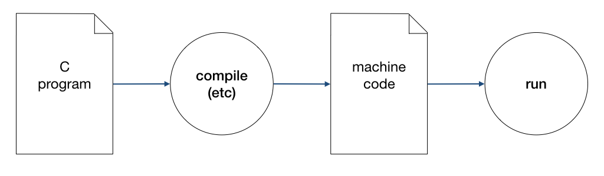

# Unit 1: What is a Program?

## Learning Outcomes

After this unit, students should:

- have an idea of what is a program and how a program is executed by a computer
- understand the basic terminologies: machine code, assembly language, and higher-level programming languages

## What is a (computer) program?

Despite all the wonderful and amazing things that computers can do, computers are not very smart. In fact, they are pretty dumb. Computers can only follow the instructions given by a human. A computer program is a sequence of step-by-step instructions given to computers to manipulate data in order to perform a certain task.

Programming is the art and science of writing a computer program, and that is what you will learn to do in CS1010.

## How computer executes a program

In order to learn how to write a program, it is important to have an overview of how a computer executes a program.  You will learn in details how this is done in CS2100/CS2106 or EE2024/CG2271, but for CS1010, we will take a very simplistic and high-level view of this process.

The two important components of a computer we will discuss for CS1010 is the CPU, or _central processing unit_ and the memory, which is a generalized term for where we store the data to be processed or manipulated by the CPU, as well as the instructions to do so.  A memory location is addressable using a _memory address_.  

The instructions to the CPU comes in the form of _machine code_, a sequence of bits (1s and 0s) that is interpreted and then followed by the CPU to do certain things.  These machine code could instruct the CPU, for instance, to compare if a particular number at a certain memory location is more than 0, to add one number to another, or to execute another instruction at another memory location.  The data stored in the memory is also stored as a sequence of 1s and 0s.

## From Machine Code to High-level Programming Language

While it is possible for us, human, to write machine code directly, few actually do since it is challenging to do so. Different CPUs understand different sets of machine code; it is tedious to figure out where each piece of data is located in the memory (this location is actually determined by the operating system).  The resulting code, even when it is correct and easy to read and understand by the machine, are often hard to decipher for a human.
Simple operations such as comparing two numbers to see which one is bigger might require several instructions to perform.

To get around the readability problem, programmers can code in _assembly language_ -- a human-readable form of machine code, where each instruction, instead of represented by 0s and 1s, is represented by a mnemonic (such as `decr`, `incr`, `store`, `add`, etc.)

Writing assembly code does not address the issues of machine-dependent code and the tediousness of programming.  Early programmers (in the fifties) understood this and designed _high-level programming languages_, where programmers can describe the operations that they wish to do in a language closer to their intention that is machine independent.  A program written in one of these programming languages is then _compiled_ into machine code for a specific CPU for execution using a compiler.

The first commercially available language is FORTRAN from IBM in the 1950s.  Among many early programming languages, C (birth year 1972) is the only one that is still popular and widely used today,  [For many reasons](readings.md#why-c), C is the language of choice for CS1010.  

## The Goals of CS1010

This brings us to the goals of CS1010.  First, you will learn the most important syntax element of the C programming language.  Second, you will learn how a C program behaves, in relation to how a program is executed and how data are stored and manipulated in memory.  Third, you will learn the various tools and techniques that will help you produce good and correct C programs.

The last, and the most important and challenging goal of CS1010, however, is that you will learn how to write programs to solve computational problems.  Learning to write a program that does what you want it to do is actually not difficult.  _Knowing what you want your program to do is the more challenging part!_
