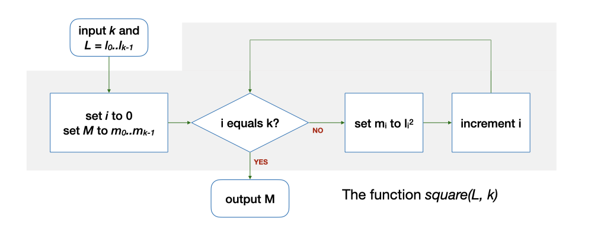
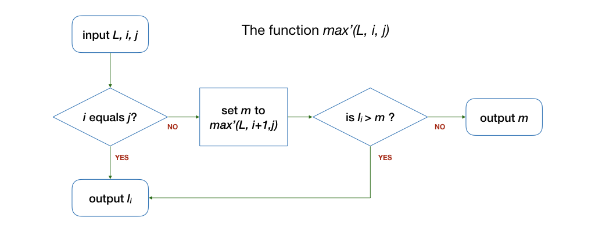
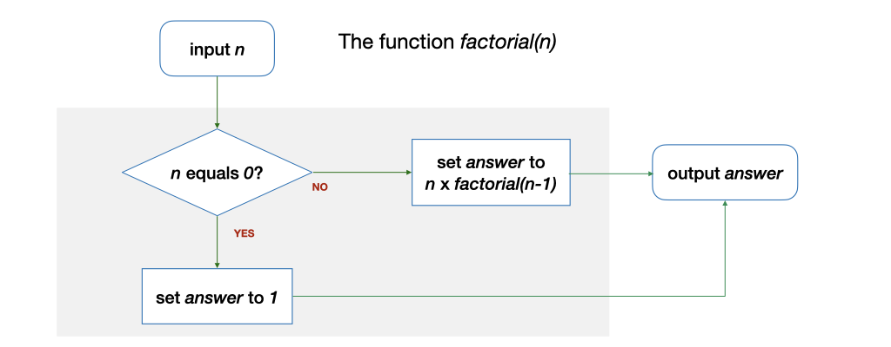

# Unit 3: Functions

## Learning Outcomes:

After this unit, students should:

- understand the concept of a function: (i) function as a high-level abstraction of lower-level operations; (ii) function as a well-defined solution to a sub-problem with zero or more inputs and (possibly) a returned value.
- be able to see how a problem can be decomposed into sub-problems, each solvable by a function; the functions can then be composed together to solve the original problem;
- understand the concept of local variables that are internal within a function;
- be able to apply "wishful thinking" in decomposing a problem into sub-problems;
- apply wishful thinking in solving a problem recursively -- by making a function invokes itself to solve a simpler version of the same problem.

## Problem: Finding the Range

Let's start with another problem.

The _range_ of a finite list of at least one integers $L$ is defined as the difference between the maximum and the minimum integers in $L$.  For example, the range for `4 1 -4 0 9 9 3 5 8` is `13`.  How do we find the range of a given list?

To find the range of a list, we can break the solution down into three subtasks: first, find the maximum, then, find the minimum, and finally, find the difference between the two.  

From the previous lecture, you already know how to find the maximum and the minimum (from Problem 1.2)!  So, in expressing the algorithm to find the range, _we can refer to a previous solution to a sub-problem, which we assume we already know how to solve_.  

Let's call our solution to find the maximum value from a given list $L$ as $max$.  $max$ takes as input (i) a list $L$ and (ii) $k$, the number of integers in $L$.  It produces, or _returns_, the maximum value among the integers in $L$.  Borrowing from mathematical notation, we use the notation $max(L, k)$ to represent the maximum value of $L$.  Note that, now, we no longer worry about $i$ and $m$ -- these two variables are now internal, or _local_, to $max(L,k)$.

Suppose that $min(L,k)$ returns the minimum value among the integers in $L$, then, the algorithm to find the range of $L$ can be written in a single line:

$$max(L, k) - min(L, k)$$

## Functions

$max$ and $min$ are examples of a powerful and important concept with many names: _function_, _procedure_, _subroutine_, _method_, _subprogram_[^1].  In the context of CS1010, we will use the term _function_.  Functions allow us to solve a problem by thinking about the solution at a higher level.  We no longer concern with the implementation details. 

For instance, in the example above, we no longer have to think about checking through the items in the list one-by-one and maintaining the maximum so far, or the minimum so far.  We just have to think about how to compute the range, assuming that we already know how to compute the maximum and the minimum value.

[^1]: There are subtle differences between these terms -- but they are all a form of _functional abstraction_, where we abstract out the detailed operations and represent it with a single higher-level "action".

Such an assumption, that we already know how to solve a subproblem, is known as _wishful thinking_.  Sometimes, it is useful to solve a problem assuming that you know how to solve the subproblem first, then worry about solving the subproblem later.  

For instance, consider the following problem: Given a finite list of $k$ integers ($k > 0$), find the mean.  

The algorithm again can be written in one line:

$$sum(L, k) / k$$

if we assume that we have a function $sum$ that can help us find the total of all $k$ integers.  It turns out, in this case, that you should also know how to solve the subproblem $sum$ since it is Problem 1.3 from last week.

We can then make this into a function itself, $mean(L, k)$, which we can now use to solve other more complex problems.

Thinking in terms of functions also has another advantage: given a function, we only need to worry about _what_ it does, but not _how_ it is done.   In the $max(L,k)$ example above, we do not care if it scans the list $L$ from $l_0$ to $l_{k-1}$, or from $l_{k-1}$ to $l_0$.  We can treat a function as a black box with well-defined behavior -- given one or more inputs, it will produce a value satisfying certain conditions, i.e., it solves a computational problem.  

Many programming languages, including C which we will be using in CS1010, come with a rich set of predefined functions that we can use to help us solve computational problems.  In CS1010, we will also provide you with some functions to help you with your lab assignments.  You will also define your own functions when solving problems with C.  In fact, a C program is just a collection of functions calling each other.

Note, however, that in C, a function is more general than the description above: a C function may not take in any input, and it may not return any value.  

## Problem: Finding Standard Deviation

Let's look at another problem: Given $L$, a finite list of at least one integers, find the standard deviation of the integers in $L$.  

First, recall that the (population) standard deviation is given by

$$\sqrt{\frac{\sum_{i=0}^{k-1} (l_i - \mu)^2}{k}}$$

where $\mu$ is the mean of the integers in $L$.

To compute the standard deviation, we first need to compute $\mu$, the mean.   We already know how to do that: $mean(L, k)$.  Then, we need to compute $\sum_{i=0}^{k-1} (l_i - \mu)^2$.  We can break it down into two subproblems:

- Given a list $L$ and a constant value $x$, subtract $x$ from every number in $L$, giving us a new list.
- Given a list, square every number in the list, giving us a new list.

For now, let's apply wishful thinking and assume that we know how to compute the above two steps with functions $subtract(L, k, x)$ and $square(L, k)$, then, the formula $\sum_{i=0}^{k-1} (l_i - \mu)^2$ can be computed by the following steps:

- set $\mu$ to $mean(L, k)$
- set $L'$ to $subtract(L, k, \mu)$
- set $L''$ to $square(L', k)$
- set $total$ to $sum(L'', k)$.

We can also write it in one line:

- set $total$ to $sum(square(subtract(L, k, mean(L, k)), k), k)$

Now, to compute the standard deviation, we need to divide $total$ by $k$ and find the square root.  But, finding $total$ and dividing the result by $k$ is just $mean$.  To compute square root, we again apply wishful thinking and assume that there is a function $sqrt$ to do so.

We can now compute the standard deviation with one line:

$$sqrt(mean(square(subtract(L, k, mean(L, k)), k), k))$$

Using functions, we can easily pass the output from one function as input to another, essentially chain the functions together, like Lego blocks, to solve problems.  We also see an example of _reuse_ here -- $mean$ is used twice with different inputs.

!!! warning "Returning a list"
    While the above one-liner is an elegant solution, when we actually implement this in C later, it will not so simple and elegant.  Let's worry about that later.

Now that we have seen how to compute standard deviation by breaking it down the four subproblems, $sqrt$, $mean$, $square$, and $subtract$, we have to make sure that things we wish can be done can actually be done.  The C library, and many programming languages, provide a pre-defined method to compute $sqrt$.  We already know how to compute $mean$.  Computing $square$ can be done as follows:

The implementation of $subtract$ is similar.

## Another Solution for Finding Maximum

In the previous lecture, you have seen an algorithm to find the maximum value from a list of integers, which involves checking the elements one-by-one and keeping track of the maximum value so far.

Now that we have seen what a function is, we can use the concept of wishful thinking to help us solve this problem in a different way and more elegant way.

Let's suppose that we have a function $max'(L, i, j)$, that finds the maximum integer among the elements $l_i, l_{i+1}, ... l_j$.  The function $max(L, k)$, which finds the maximum among all elements of $L$, is therefore the same as $max'(L, 0, k-1)$.

Do we know how to solve $max'(L, i, j)$ without checking the integers in $L$ one-by-one?  Well, if $i$ equals to $j$, i.e., there is only one element in the range of $l_i, ..., l_j$, then yes, the function should return the value of $l_i$.  But, what if there are multiple elements in the range? (i.e., $i < j$)?  By wishful thinking, we assume that we already know how to solve smaller (as in a shorter list) problem -- $max'(L, i+1, j)$, so the maximum value for the range of $l_i, ..., l_j$ is the larger of the two: either $l_i$ or $max'(L, i+1, j)$.  We can express this algorithm as follows:

Let's trace through the algorithm above, using our previous example: `4 1 -4 0 9 9 3 5 8`.  Given this list, we compare the first element, `4`, with the maximum of the rest of the list `1 -4 0 9 9 3 5 8`.  Since with wishful thinking, we know how to solve this already, we get `9` as the maximum value of `1 -4 0 9 9 3 5 8`.  Comparing `4` and `9`, `9` is larger. Thus, the maximum value for the whole list is `9`.

## Example: Finding a Factorial

Let us look at another example of a function before we move on to another topic.  Suppose we want to write a function $factorial(n)$ for an integer $n$ ($n \ge 0$) that computes $n!$. Recall that $n! = n \times n - 1 \times n - 2 \times ... 2 \times 1 = n \times (n-1)!$.  As a special case, $0!$ is defined to be $1$.

The algorithm to do this can be expressed by the following diagram:

Let's look at an example.  Let's say we want to compute $factorial(4)$.  We assume we know how to solve this for a smaller problem --  $factorial(3)$, which is 6.  $factorial(4)$ is thus 4 $\times$ 6, i.e., 24.

## Recursion: Function Calling Itself

$max'$ and $factorial$ are examples of functions that calls itself to solve a simpler version of the problem.  This is known as _recursion_.  We will revisit this concept in much greater detail in the later part of CS1010.

## Problem Set

### Problem 3.1 : Getting MAD

The mean absolute deviation, or MAD, of a set of integers measures how spread out a set of data is.  The _absolute deviation_ is the absolute difference between an element in the list with the mean of values of the list.  The mean absolute deviation is the mean of all the absolute difference.  In other words, given $L = \{l_0, ... l_{k-1}\}$, the MAD of $L$ is:

$$\frac{\sum_{i=0}^{k-1} |l_i - \mu|}{k}$$

How do you find MAD by composing various functions we have seen?  Do you need a new function?

### Problem 3.2 : Ownself calls ownself

(a) Give an algorithm for finding the sum of all the integers in the list $L$ with $k$ ($k > 0$) integers that is recursive.

(b) The function $pow(i, j)$ computes $i^j$.  Give an algorithm to compute $pow(i, j)$ recursively.
