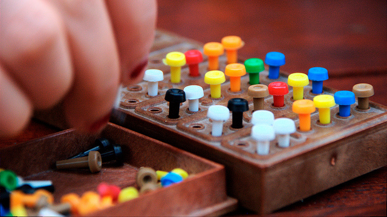

# Assignment 4: Mastermind, Kendall, Subtract

### Deadline

11 October 2022 (Tuesday), 23:59 pm.

### Prerequisite

- Solve [Exercise 9](ex09-len-cat-find.md)

### Learning Objectives

- Writing C programs that use fixed-size arrays and dynamic-size arrays, and know when to use which
- Manage memory allocation and deallocation correctly
- Processing and manipulating strings as a null-terminated array of chars
- Be able to write C documentation, following the Doxygen documentation format.

### Grading

This assignment contributes to **4%** of your final grade.  The total marks for this assignment are 40 marks.  

For Assignment 4, we may deduct up to 1 mark _for each question_ for style violation.  Ensure that your code is neat and readable, adhering to the CS1010 coding convention.

Furthermore, 2 mark is allocated to documentation. Your code should follow the good practices of breaking down your solution into small functions. Document each function (except `main`) following the Doxygen documentation format, as outlined [here](../guides/documentation.md).  Your code must have at least one non-trivial function (other than `main()`) to be eligible for these 2 marks.

The rest of the marks are allocated to correctness -- this includes the correctness of syntax, practices, approach, and logic, and whether you correctly follow our instructions.  Note that _even if your solution produces the correct output every time, it may not get full marks if the approach is wrong._

## Question 1: Kendall (10 Marks)

Suppose that we are given a set of items and we ask two
different parties to rank the items according to some order.
We may get two different orders of the items. How do we
measure how similar (or dissimilar) the two rankings are?

For example, consider a search engine that returns a list of
web pages ranked by their relevance to the search query. A
user may not always agree with the ranking of the search
engine and may judge the relevance of the search result
differently, i.e., the user may have his or her own ranking.
This measurement of similarity between the ranking by the
search engine and the ranking by the user gives us a metric
on how good the search engine result is. The more similar it
is to the ranking of the user, the better the search engine
is in ranking in the search results.

One way to measure the similarity of the two rankings is the
Kendall tau distance. You will write a program `kendall` that
calculates the normalized Kendall tau distance for this
question.

We will represent a ranking by the order of the items. The
first item is ranked 1, the second is ranked 2, and so on. To
simplify the problem, we take one of the rankings that we
want to calculate the Kendall tau distance on and label the
items sequentially, as the sequence 1, 2, 3, 4, 5, ... $n$,
where n is the number of items. We call this the base
ranking. The other ranking will then be a permutation of the
numbers 1 to $n$.

For example, suppose we have three items A, B, and C. The first
ranking ranks the items as B, C, and A. The second ranking ranks
the items C, A, B. After relabelling the first ranking as 1,
2, 3, the second ranking becomes 2, 3, 1.

The Kendall tau distance counts the pairs of items
in one ranking that are ranked in a different order in the other
ranking. In the example above, we have three possible pairs:

Pair | Ranking 1 | Ranking 2
-----|-----------|----------
A-B  | B then A  | A then B
A-C  | C then A  | C then A
B-C  | B then C  | C then B

Out of the three pairs, the pair A-B and B-C are ordered
differently in the two rankings, so that Kendall tau
distance is 2.

The normalized Kendall tau distance is the ratio of the
number of pairs ranked in a different order to all possible number of pairs.

In the example above, the normalized Kendall distance is
2/3 = 0.6666.

Your program should read the following from the standard
input:

- The first positive integer, $n$, is the number of items
  ($n \ge 2$).
- The next $n$ numbers are a permutation of integers between
  1 to $n$. This corresponds to the ranking of the items
  from 1 to $n$.

Your program should print the normalized Kendall tau
distance between the ranking read above and the base ranking
(1, 2, 3, .. $n$) to the standard output.

Your program must not assume any limit to the length of the
input, except that their length can fit into the type `size_t`.

### Sample Runs

```
ooiwt@pe118:~/as03-skeleton$ ./kendall
3
2 3 1
0.6667
ooiwt@pe118:~/as03-skeleton$ ./kendall
10
1 2 3 4 5 6 7 8 9 10
0.0000
ooiwt@pe118:~/as03-skeleton$ ./kendall
6
6 5 4 3 2 1
1.0000
```


## Question 2: Mastermind (15 marks)



Mastermind is a board game played by two players, a
_coder_ and a _codebreaker_.  The coder creates a code
that consists of four color pegs, chosen from pegs of
six different colors (cyan, green, red, blue, purple, and orange).  
Repetition of the same colors is allowed.
The codebreaker's task is to guess the colors of the
pegs and the order they appear in the code.

The game proceeds in rounds.  In each round, the
codebreaker tries to guess the code by specifying the
colors and the order of the colors.  The coder then
provides feedback to the codebreaker, with two smaller
pegs of black and white color.  A black color peg is
placed if the codebreaker guesses correctly a peg in both
position and color.  A white color peg is placed if the
codebreaker guesses correctly a peg in color but not in
the position.  Based on the feedback, the codebreaker
guesses again in the next round.  The codebreaker wins if
he guesses correctly every color in the correct order.
In the board game version of this game, the coder wins
if the codebreaker failed to guess correctly after some
agreed-upon number of guesses.  In our version, however,
the game continues until the codebreaker guesses correctly.

Write a program called `mastermind` that simulates the
Mastermind game.  The program first reads the code
from the standard inputs.  We denote the colors with numbers 
`1``, `2`, `3`, `4`, `5`, `6`.  Hence, the code
is represented with 4 numbers, e.g., `1 3 5 4`.

The program then reads in a sequence of guesses, each is
4 single-digit number ranged from 1 to 6.  For each guess,
the program prints out two numbers, the first is the number
of pegs that are correct in both position and color.
The second is the number of pegs that are correct in
color but not position.  Note that we do not double count,
so the total of these two numbers is at most 4.

For example,  if the code is `5 3 6 4` and the guess is
`4 6 3 2`, the program prints `0 3`.  Since none of the
guesses is correct in both color and position.  The three
colors `3`, `4`, `6`, however, appear in the code, albeit
in a different position.  Suppose the guess is `3 3 3 3`,
the program prints `1 0`.  The third `3` is the guess that
appears in the correct position and correct color.  There
is no other `3` in the code, so the second number is 0.
This example illustrates that we do not double-count.
We do not match the other `3`s in the guess to the `3`
in the code, once the `3` in the code has been matched.

The program terminates when the guess is the same as
the code.

### Sample Run

```
ooiwt@pe119:~/as04-skeleton$ ./mastermind
5 3 6 4
4 6 3 2
0 3
3 3 3 3
1 0
4 4 4 4
1 0
6 6 3 3
0 2
5 3 5 4
4 0
ooiwt@pe119:~/as04-skeleton$ ./mastermind
1 1 1 5
4 6 3 2
0 0
5 3 6 4
0 1
6 6 6 1
0 1
1 6 6 1
1 1
5 1 5 1
1 2
1 5 1 5
3 0
1 1 1 5
4 0
```

## Question 3: Subtract (15 marks)

In this question, you are asked to write a program that subtracts
two non-negative numbers which can be arbitrarily large.

The types provided by C can only represent a number up to a
certain value.  Thus, for this question, we will represent an 
integer using an arbitrarily long string consisting of characters 
(of type `char`) `'0'` to `'9'` (note: not integer 0 to 9).  

C supports arithmetic operations on `char` values as well.  To
convert a digit character to the numerical value of a digit character, we
can do the following:

- To convert from a digit character to its numerical value,
  we subtract the `char` `'0'`.  For instance, `'6' - '0'`
  will give us the value 6.

- To convert from a numerical value of a digit to its
  character, we add the `char` `'0'`.  For instance, `6 + '0'`
  will give us the character '6'.

Write a program `subtract` that reads, from the standard input, two
non-negative numbers $a$ and $b$, represented as strings consisting of
digits `'0'` to `'9'` ($a \ge b$).  The program then prints $a - b$ 
to the standard output.

You will likely need to use the C standard library function
`strlen`, which returns you the number of characters in a
string (excluding the terminating `'\0'`).  Look up how to
use this function on your own.  You might need casting of
the return value to avoid warnings.

Your program must not assume any limit to the length of
the input, except that their length can fit into the type
`size_t`.

In particular, you must not convert the input string to 
an integer before subtracting, since if the input string is 
long enough, it would not fit into a C integer type.

### Sample Runs

```
ooiwt@pe119:~/as06-skeleton$ ./subtract
2
1
1
ooiwt@pe119:~/as06-skeleton$ ./subtract
10
9
1
ooiwt@pe119:~/as06-skeleton$ ./subtract
1000000
1
999999
ooiwt@pe119:~/as04-skeleton$ ./subtract
19330911933091193309119330911933091
1400060514000605140006051400605
19329511872577192703979324860532486
```
