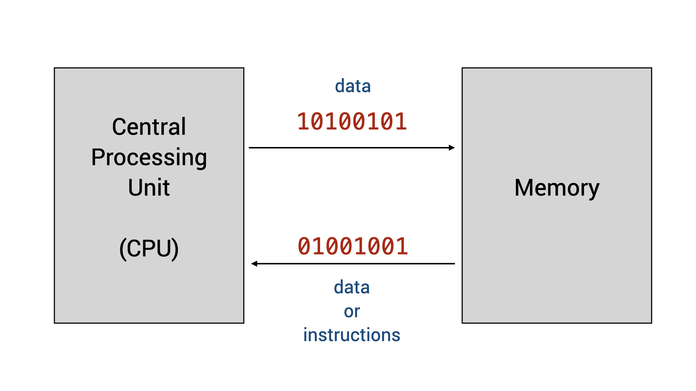

# Unit 1: What is a Program?

## Learning Outcomes

After this unit, students should:

- have an idea of what is a program and how a program is executed by a computer
- understand the basic terminologies: machine code, assembly language, and higher-level programming languages

## What is a (computer) program?

Despite all the wonderful and amazing things that we can do with our computers, computers are not very intelligent.  Computers can't act or think by themselves.  All they can do is execute instructions written by humans.  These step-by-step instructions given to computers by humans is called a _program_. 

## What is programming?

Programming is the act of giving step-by-step instructions to a computer to perform a certain task.  Doing so requires human _programmers_ to communicate with a computer.  Such communication is achieved using _code_ written in a _programming language_, following a set of grammatical rules and meanings, that both the computer and human programmer understands.  

!!! notes "Coding vs. Programming"

    People often confuse the two terms: coding and programming.  The act of translating step-by-step instructions to a program using a chosen programming language is called _coding_.  But programming is more than coding.  It involves among other things, coming up with the correct step-by-step instructions to give to computers for execution to achieve a given task.

## Program Execution

How does a computer execute a program?  Every computing student should have at least a basic understanding of this process.  You will learn in detail how this is done in later modules CS2100/CS2106 or EE2028/CG2271, but for CS1010, we will take a very simplistic and high-level view of this process.

The two important components of a computer we will discuss for CS1010 are (i) the CPU, or _central processing unit_, which contains the electronic circuitry needed to execute the instructions, and (ii) the memory, which is a generalized term for where we store the data to be processed or manipulated by the CPU, as well as the instructions.  

The instructions to the CPU come in the form of _machine code_, a sequence of bits (1s and 0s) that is interpreted and then followed by the CPU to do certain things.  These machine codes could instruct the CPU, for instance, to compare if a particular number at a certain memory location is more than 0, to add one number to another, or to execute another instruction at another memory location.  The data stored in the memory is also stored as a sequence of 1s and 0s.

## From Machine Code to High-level Programming Language

While human programmers can write programs in machine code directly, doing so is a challenging endeavor and few actually do.  The challenges stem from a few reasons:  First, different CPUs understand different sets of machine code. Second, it is tedious to figure out where each piece of data is located in the memory (this location is determined by the operating system). Finally, the resulting code, even when it is correct and easy to read and understand by the machine, is often hard to decipher for a human.
Simple operations such as comparing two numbers to see which one is bigger might require several instructions to perform.

To get around the readability problem, programmers can code in _assembly language_ -- a human-readable form of machine code, where each instruction, instead of represented by 0s and 1s, is represented by a mnemonic (such as `decr`, `incr`, `store`, `add`, etc.).   You will learn how to write programs in assembly languages in CS2100 and EE2028.

Writing code in assembly languages, however, does not fully address the issues of machine-dependent code and the tediousness of programming.  Early programmers in the fifties thus designed _high-level programming languages_, where programmers can describe the operations that they wish to do in a language closer to their intention, in a machine-independent manner.  These high-level programming languages come with an associated software tool called the _compiler_.  The compiler _compiles_ a program written in one of these programming languages into machine code for a specific CPU for execution using a compiler.

The first commercially available language is FORTRAN from IBM in the 1950s.  Among many early programming languages, C (birth year 1972) is the only one that is still popular and widely used today,  [For many reasons](../readings.md#why-c), C is the language of choice for CS1010.  

## The Goals of CS1010

With the background above, we can now elaborate on the goals of CS1010.

First, you will learn the most important syntax elements of the C programming language and how to express the tasks that you want your computer to perform by writing a C program.
C is a relatively simple language but some aspects of C are confusing to beginners.  As such, we will not cover every aspect of C.  Furthermore, we will ban some syntax of C from being used in CS1010.    

Second, you will learn how a C program behaves, including how data are stored and manipulated in memory. This understanding is essential for writing a C program to run on resource-constraints devices as well as for understanding the security pitfalls.

Third, you will learn how to write _good_ programs.  A program not only needs to correctly express the tasks for a computer to execute, but it also needs to be read and understood by humans.  You will learn to follow a clean coding style, document your code, etc., to make your code readable and changeable by yourself or other programmers.

The last and the most important and challenging goal of CS1010, however, is that you will learn how to write a program that solves a given problem.  If you know what you want your program to do, step-by-step, translating that sequence of steps into C is not that difficult.  _Determining what you want your program to do is the hardest part!_.  This learning outcome is also the least language-dependent -- once you know what steps your want your program to perform, you can translate these steps into a program written in other languages, not limited to C.
