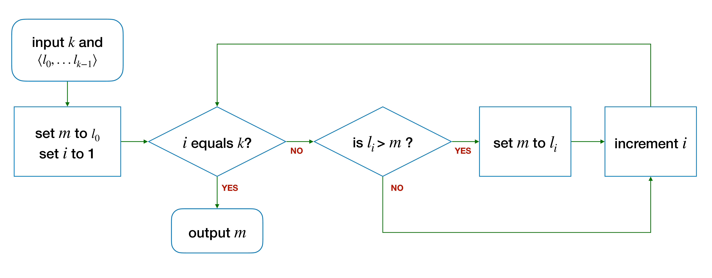
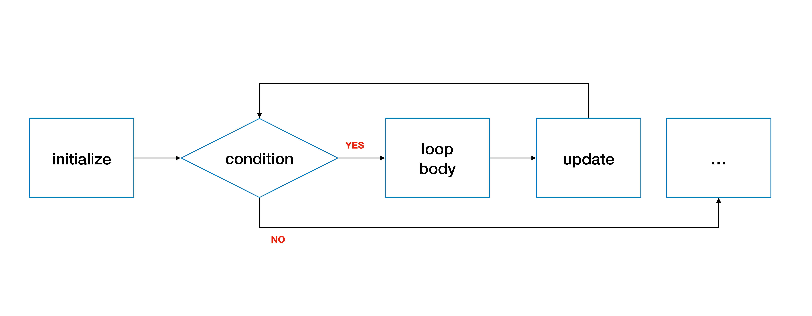

# Unit 11: Loops

## Learning Objectives

After this unit, students should:

- be able to identify the four components of a loop: initialization, body, update, and condition
- be able to express a computational solution as a loop with the four components above
- be able to implement a loop using either the `for, `while`, or `do-while` construct in C
- be able to trace through the control flows of each loop construct
- understand the correspondence between the different loop constructs
- be aware of the "infinite loops" bug, what causes it, and what to pay attention to avoid it.

In [Unit 8](08-if-else.md), you were introduced to writing code that follows one of two possible execution paths using the `if`-`else` statements, using a logical expression to decide which path to take.

Sometimes, we want to execute one of the branches repeatedly (or iteratively), over and over again, until a certain logical condition is met.  You have seen this construct in the $max$ and $sum$ example, where we repeatedly go through the numbers in the list until $i == k$.

## Writing Loops

To write a loop, we need to think about the following four questions:

- what do we want to do repeatedly?
- what do we need to set up before repeating the above?
- what changes from one repetition to another?  
- how to decide if we should stop repeating (or conversely, continue repeating?)

There is a fifth question that is as important as the above but is harder to answer (and not necessary for writing simple loops), so we will leave it to [Unit 12](12-invariant.md).

Let's revisit the example of `max`.  Here is the answer to the four questions:

- What do we want to do repeatedly?  We want to compare the element $l_i$ to $m$, and update $m$ to $l_i$ if $l_i > m$.

- What do we need to set up before repeating the above?  We need to have some initial values of $m$ and $i$.  We set it up as $m = l_0$ and $i = 1$.

- What would be different each time we repeat the above?  Every time we repeat, $i$ will be different.  To be more precise, $i$ is one more than before.

- How to decide if we should continue repeating the above?  We stop when there is no more element to compare, i.e., $i$ equals $k$.  In other words, we continue if $i < k$.



Let's consider another example.  We have seen how to compute factorial recursively.  Let's try to compute factorial using a loop.

Recall that $n! = n \times n-1 \times n-2 .. 2 \times 1$.  Given $n$, how do we find $n!$ using a loop?  

The idea to solve this with a loop is to start with the value $n$, and repeatedly multiply another value $i$, starting with $i = n - 1$, then $i = n - 2$, etc., until $i = 2$.  We do not need to multiply with $i = 1$ since it does not change the value.

Like any other problem, we need to consider what are the variables we need to maintain.  In this case, we should maintain the partial product of the factorial and a variable $i$ that corresponds to the value to multiply into the partial product.

- What do we want to do repeatedly?  Multiply $i$ into the partial product.
- What do we need to set up before repeating the above?  We set up the partial product to be $n$ and $i$ to be $n - 1$.
- What changes from one repetition to another?  $i$ would decrease by one every time we repeat the above.
- How to decide if we should stop repeating (or conversely, continue repeating?)  We can stop when we have multiplied $i = 2$ to the partial product.

We can express the algorithm above using the following flowchart:


## A `for` loop

Now that we have seen the four essential elements of a loop, let's write some loops in C.

C provides three ways to write a loop.  Let's start with a simple one:  the `for` loop.  

The `for` loop in C has the following syntax:

```C
for (<initialize>; <condition>; <update>) {
    <body>
}
```

There are four components, corresponding to the four questions above:

- The `initialize` statement sets up the loop (i.e., "What do we need to set up before repeating the above?").  
- The `condition` statement indicates when we should stop repeating.  If it evaluates to `true`, it will cause the loop to continue, otherwise, the loop stops.
- The `update` statement is executed after every loop.  (i.e., "What changes from one repetition to another?")
- The `body` statement is the action that we want to do repeatedly.  



For the `initialize` and `update` statement, even though C allows us to include multiple initializations and multiple updates, it makes the code harder to read and understand.  C also allows us to have empty statements for `initialize`, `condition` and/or `update`.  As such, in CS1010, we will stick to performing one initialization and one update only.

For example, in the setup phase for factorial, we should initialize the partial product to $n$ and $i$ to $n - 1$, that's two assignments.  We commonly choose the index which we increment or decrement as we loop, hence we choose to initialize $i$ in the `initialize` statement of the `for` loop, and leave the initialization of `product` to a separate assignment before the `for` loop.

Here is an example on computing the factorial with a for loop:

```C
long factorial(long n)
{
    long product = n;
    for (long i = n - 1; i >= 2; i -= 1) {
        product *= i;
    }
    return product;
}
```

The code above is almost correct.  We only need to handle the special case when `n` is 0.  The complete code for the function is thus:

```C
long factorial(long n)
{
    if (n == 0) {
        return 1;
    }
    long product = n;
    for (long i = n-1; i >= 2; i -= 1) {
        product *= i;
    }
    return product;
}
```

## `while` Loop

The second way to write a loop in C is to use a `while` loop.  The while loop looks like this:

```C
while (<condition>) {
    <body>
}
```

The statements in `<body>` will be executed if `<condition>` is true.  

Note that the syntax of the `while` loop above does not contain the `<initialize>` and the `<`update>` components.  When we write the loop, however, we still need to think about them, and add them to the appropriate place in the code, as follows:

```C
<initialize>
while (<condition>) {
    <body>
    <update>
}
```

The corresponding flowchart for `while` is:


Compare the flowchart for `while` to the flowchart for `for` earlier.  You will see that they are the same!


Here is the `while` version of the `factorial` function:
```C
long factorial(long n)
{
    if (n == 0) {
        return 1;
    }
    long product = n;
    long i = n - 1;
    while (i >= 2) {
        product *= i;
        i -= 1;
    }
    return product;
}
```

In the `while` loop, however, we can be more flexible in terms of what we want to do inside the loop.  Technically, there is no difference between `update` and `body` since they are just a bunch of C statements.  We can interleave `<update>` and `<body>` or execute `<update>` first before `<body>`, depending on the algorithm.  With `for` loop, there is no such flexibility as `<update>` has to be executed after `<body>`.

## A `do-while` loop

The third way we can write a loop in C is to use a `do-while` loop.  The `do-while` loop is very similar to `while`, except that the body of the loop is guaranteed to be executed at least once.  

```C
<initialize>
do {
    <body>
    <update>
} while (<condition>);
```


Similar to the `while` loop, the `<body>` component and `<update>` component in the loop do not have to be in order.

!!! note "Alert"
    There is a semicolon `;` after a `do-while` loop.

Let's look at an example where using `do-while` is more natural than `while`.

## Example: Guess a Number

Let's write a program that plays a game with the user.  The program generates a random integer number between 1 and 100.  The user will guess what that number is.  If the user guesses correctly, the program congratulates the user.  Otherwise, the program tells the user whether the guess is too high or too low, and let the user guess again.  This process repeats until the guess is correct.

Note that, here, the user needs to guess at least once, so it is more natural to use a `do`-`while` loop than a `while` or a `for`.

### Answering The Four Questions

- What do we want to do repeatedly?  We want to read the guess from the user and respond to the user.
- What do we need to set up before repeating the above?  We need to generate a random integer between 1 and 100.
- What changes from one repetition to another?  The guess _may_ be different.
- How to decide if we should continue repeating the above?  We stop when the guess is correct.

### Designing the Flowchart

Here is the flowchart of the steps described above.


### The C code

The entire corresponding program is shown below:

```C
#include <stdlib.h>
#include <sys/times.h>
#include "cs1010.h"

int main()
{
  // Initialize the random number generator
  srandom(times(0));

  // Generate a random number between 1 and 100
  long answer = (random() % 100) + 1;

  long guess;
  do {
    // Read guess and feedback to user
    guess = cs1010_read_long();
    if (guess > answer) {
      cs1010_println_string("too high");
    } else if (guess < answer) {
      cs1010_println_string("too low");
    }
  } while (guess != answer);

  // { guess == answer }
  cs1010_println_string("you got it.  congrats!");
}
```

I will not go into details of what `srandom(times(0))` means.  You can look it up on your own if you are interested (InfoSec students may want to do this as generating a good random number is key to keeping systems secure).

The function `random()` generates a random integer, which we limit to 0 to 99 by modulo-ing it with 100.  We then add 1 to it to a number between 1 and 100, inclusive.

## Infinite Loop

One of the common bugs that programmers encounter when writing loops is the _infinite loop_.  An infinite loop is a loop that never terminates until an external input ++control++++c++ terminates the program.


Consider the slight variation of the `factorial` function below:

```C
long factorial(long n)
{
    if (n == 0) {
        return 1;
    }
    long product = n;
    long i = n - 1;
    while (i != 2) {
        product *= i;
        i -= 1;
    }
    return product;
}
```

What is the return value of `factorial(-2)`?  Take a moment to trace through the code.

The answer is that `factorial(-2)` will never return!  Since `i` is initialized to `-3` on Line 7, and `i` only get smaller every time Line 10 is called.  So, the terminating condition `i != 2` will never be true.  As a result, the loop never terminates.

Let's examine under what condition would a loop continue forever, using three of the loop components: `<initialize>`, `<update>`, and `<condition>`.  

Consider the variable(s) used in `<condition>` and the condition in which `<condition>` evaluates to _false_.  This is the _terminal state_ of the loop.  Now consider how these variables are set up in `<initialize>`.  This is the _initial state_.  For the loop to terminate, the sequence of operations performed by the `<update>` component must transit these variables from the initial state to the terminal state.  Otherwise, the loop will never terminate.

As an example, let's consider what happens when we call `factorial(10)`.  The terminal state is `{ i == 2 }`.  The initial state is `{ i == 9 }`.  The update is performed by subtracting 1 from `i` in every loop.  So the value of `i` starts at 9, and it becomes 8, 7, 6, .. and eventually the condition `i == 2` will be true, `i != 2` will be false, and the loop terminates.

As an example, let's consider what happens when we call `factorial(-2)`.  The terminal state is `{ i == 2 }`.  The initial state is `{ i == -3 }`.  The update is performed by subtracting 1 from `i` in every loop.  So the value of `i` starts at -3, and it becomes -4, -5, -6, ...  The `<update>` condition is moving the state _away_ from the terminal state.  So this loop never terminates![^1]

[^1]: Since a `long` variable can only store a limited range of values, eventually `i` will overflow and become positive again and reach the value 2.  So the loop will still terminate, albeit after a long time (no pun intended) if we consider overflow.  For CS1010, we still consider such a loop as an infinite loop.

To prevent the infinite loop bug, when developing your `<initialize>`, `<update>`, and `<condition>`, make sure that `<update>` always nudges the state from the initial state stated in `<initialize>` to the terminating condition specified by `<condition>` at each iteration and the terminal state is achievable eventually.

Now, consider the version of `factorial` where the terminating condition is `{ i < 2 }`.  

```C
long factorial(long n)
{
    if (n == 0) {
        return 1;
    }
    long product = n;
    long i = n - 1;
    while (i >= 2) {
        product *= i;
        i -= 1;
    }
    return product;
}
```

This version does not have the possibility of an infinite loop.  Regardless of the initial state (i.e., regardless of what the value of `i` is initialized to), we will always reach the terminal state.

## Problem Set

### Problem 11.1

Here is another version of the `factorial` function:

```C
long factorial(long n)
{
    long i = n - 1;
    long product;
    for (product = n; i >= 2; product *= i)
    {
        i -= 1;
    }
    return product;
}
```

Does this code run correctly?  If it is incorrect, explain what is wrong and suggest a fix.  (Hint: translate this to the corresponding flowchart and trace through the flowchart).

### Problem 11.2

Trace the following algorithms:

```C
long mystery(long n, long k) {
    long something = n;
    long count = -1;
    while (something >= 1) {
        something /= k;
        count += 1;
    }
    return count;
}
```

(a)
What is the return value when

- `n` is 8 and `k` is 2?  
- `n` is 81 and `k` is 3?  
- `n` is 100 and `k` is 5?

Answer these questions by reading the code first, instead of trying it out on a computer (you can verify later).

(b)
What is the mathematical expression that our mystery function here is trying to compute based on the examples above?

(c)
Give a pair of inputs that would cause the function to return the wrong answer.

(d)
Give a pair of inputs that would cause the function to loop forever.
