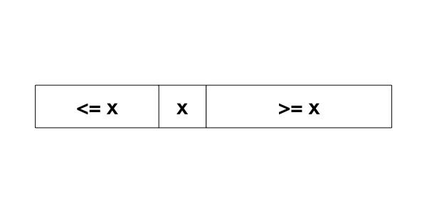

# Unit 21: Searching

## Learning Objectives

After this unit students should be familiar with the linear search and binary search algorithms, including understanding how the algorithms work, implementing the algorithms, arguing their correctness, and analyzing their running time.

## Linear Search

Let's continue the discussion on efficiency on one of the fundamental problems in computing: how to look for something.  Given a list of items $L$ and query item $q$, we wish to find if $q$ is in $L$.  If $q$ is in $L$, then we return the index of $q$.  Otherwise, we return -1.

Let's write a function to solve this.

```C
/**
 * Look for q in list[0]..list[n-1].
 *
 * @return -1 if not found, the position of q in list otherwise.
 */
long search(long n, const long list[], long q) {
  for (long i = 0; i < n; i += 1) {
    if (list[i] == q) {
      return i;
    }
  }
  return -1;
}
```

What is the worst-case running time, expressed in Big-O notation, of the function above?  Suppose the query $q$ is not in the list, we will have to scan the whole list, once.  The worst-case running time is, therefore, $O(n)$.

Can we do better?  It turns out that this running time $O(n)$ is also the best that we can do because we cannot be sure that $q$ does not exist until we check every single element in the list.  So there is no shortcut.

In previous units, we have seen a recursive divide-and-conquer solution for `max`.  We can easily adapt it to search as well:

```C
/**
 * Look for q in list[i]..list[j].
 *
 * @return -1 if not found, the position of q in list otherwise.
 */
long search(const long list[], long i, long j, long q) {
  if (i > j) {
    return -1;
  }
  long mid = (i+j)/2;
  if (list[mid] == q) {
    return mid;
  } 
  long found = search(list, i, mid-1, q);
  if (found >= 0) { 
	return found;
  }
  return search(list, mid+1, j, q);
}
```

We then call this function as:

```C
search(list, 0, n-1, q);
```

In the code above, we first handle the base case where `i > j`, which means that the sublist `list[i]..list[j]` to search for `q` in, is empty.  In this case, `q` is not found and we return -1.  If the list `list[i] .. list[j]` is not empty, we check the element in the middle if it is `q`.  If we have not yet find `q`, then we first search the left sublist.  If still not found, we search the right sublist and return the result.

In the worst case, when `q` is not in the list, we still have to check through every element in the list.  So the running time is still $O(n)$.  It is not faster than searching with a for loop.

We can also argue that the running time of the code above is $O(n)$, using the recurrence relation:

\[
   T(n)=
\begin{cases}
	2T(\frac{n}{2}) + 1,& \text{if } n > 1\\
	1,           & \text{otherwise}
\end{cases}
\]

Here, 

\[
\begin{align*}
T(n) &= 2T\left(\frac{n}{2}\right) + 1  \\
	 &= 4T\left(\frac{n}{4}\right) + 2 + 1 = \cdots  \\
	 &= 2^kT\left(\frac{n}{2^k}\right) + 2^{k-1} + .. + 4 + 2 + 1 = \cdots \\ 
	 &= nT(1) + n - 1  \\
	 &= O(n) \\
\end{align*}
\]

## Binary Search

But, do we always have to check every element in the list?  It turns out that, like many real-life situations, _if the input list is sorted_, we do not have to scan through every element.  We can eliminate a huge chunk of the elements based on whether a chosen element is bigger or smaller than $q$.

Suppose that the input list is sorted in increasing order.  Pick a random element $x$ from the list.  Any element to the left of $x$ must be less than or equal to $x$, and any element to the right of $x$ must be greater or equal to $x$. 

{: style="width:300px"}

Suppose that $q > x$, then we know that $q$ must be to the right of $x$, there is no need to search to the left of $x$.  Otherwise, $q < x$, and $q$ must be to the left of $x$, and there is no need to search to the right of $x$.

We can modify the earlier recursive function into the one below.

```C
/**
 * Look for q in list[i]..list[j].
 *
 * @pre list is sorted
 * @return -1 if not found, the position of q in list otherwise.
 */
long search(const long list[], long i, long j, long q) {
  if (i > j) {
    return -1;
  }
  long mid = (i+j)/2;
  if (list[mid] == q) {
    return mid;
  } 
  if (list[mid] > q) {
    return search(list, i, mid-1, q);
  } 
  return search(list, mid+1, j, q);
}
```

We have changed the function so that it only searches either the left side or the right side, but _never both_.

The search algorithm above is called _binary search_ since it repeatedly cut the range of values to search by half.

## Why is it correct?

It is not obvious at first glance that the code above correctly searches for $q$ in $L$. 

Let's analyze this function more systematically by writing an assertion for this function.  What we want to do here is to eliminate elements in the array that cannot possibly contain $q$ -- these are elements outside of the `list[i]` .. `list[j]` range.  In other words, we want to assert that 

```C
// { q is not in list[0]..list[i-1] and list[j+1]..list[n-1] }
```

at the beginning of the function.  In other words, this is a precondition for the function.

{: style="width:400px"}

Let's see if this precondition is true at the beginning.  Since $i$ is $0$ and $j$ is $n-1$, the ranges `list[0]..list[i-1]` and `list[j+1]..list[n-1]` are empty, so the assertion is true.

What happens if $i > j$?  This implies that $i - 1 > j - 1$, so the range `list[0]`..`list[i-1]` and the range `list[j+1]`..`list[n-1]` overlap.  We can be sure that $q$ is not anywhere in `list`. 

Let's see how we ensure this assertion is true in the recursive call.

```C
       :
  if (list[mid] > q) {
    return search(list, i, mid-1, q);
  } 
       :
```

Line 3 of the snippet above is invoked only if `list[mid] > q`.  Since the array `list` is sorted, we know for sure that any element in `list[mid+1]`..`list[j]` is larger than $q$.  So, $q$ cannot be anywhere in that range.  We can assert, between Lines 2 and 3 above:

```C
// { q is not in list[0]..list[i-1] and list[mid]..list[n-1] }
```

Thus, when Line 3 is invoked, the same assertion holds true.  You can apply the same argument to the call:

```C
  return search(list, mid+1, j, q);
```

To summarize, we annotate the code above with the assertions:
```C
/**
 * Look for q in list[i]..list[j].
 *
 * @pre list is sorted
 * @pre q is not in list[0]..list[i-1] and list[j+1]..list[n-1]
 * @return -1 if not found, the position of q in list otherwise.
 */
long search(const long list[], long i, long j, long q) {
  if (i > j) {
    // { q is not in list[0]..list[n-1] }
    return -1;
  }
  long mid = (i+j)/2;
  if (list[mid] == q) {
    return mid;
  } 
  if (list[mid] > q) {
    // { q is not in list[0]..list[i-1] and list[mid]..list[n-1] }
    return search(list, i, mid-1, q);
  } 
  // { q is not in list[0]..list[mid] and list[j+1]..list[n-1] }
  return search(list, mid+1, j, q);
}
```

## How Efficient is Binary Search

We have seen that if the input list is not sorted, then we minimally have to check every element in the list, leading to an $O(n)$ algorithm.

With a sorted input and using binary search, however, we can do better.  Let's consider the worst case, where $q$ is not in the list.  Note that for every comparison we make, we reduce the range of elements to search by half, until we reach one element.  We start with $n$ elements that could possibly contain $q$.  After one comparison, we are left with $n/2$.  After another comparison, we are left with $n/4$, etc.  It takes only $O(\log n)$ steps until we reach one element in the list.  This is a big improvement over $O(n)$ time: Suppose n is 1,000,000,000,000,000.  Instead of scanning through and comparing one quadrillion elements, we only need to compare 50 of them!

We can also argue that the running time of the code above is $O(\log n)$, using the recurrence relation:

\[
   T(n)=
\begin{cases}
	T(\frac{n}{2}) + 1,& \text{if } n > 1\\
	1,           & \text{otherwise}
\end{cases}
\]

Now,

\[
\begin{align*}
T(n) &= T\left(\frac{n}{2}\right) + 1  \\
	 &= T\left(\frac{n}{4}\right) + 2 = \cdots  \\
	 &= T\left(\frac{n}{2^k}\right) + k = \cdots \\ 
	 &= T(1) + \log n  \\
	 &= O(\log n) \\
\end{align*}
\]

## The "Magic" of Binary Search

How did we reduce the running time of searching from $O(n)$, where we have to check every element, to $O(\log n)$?  The secret ingredient here is that _we exploit the underlying property_ of the input array -- in this case, the fact that the array is sorted -- to help us eliminate some possibilities, allowing us to avoid redundant checks.

Exploiting underlying properties of the inputs is a crucial weapon we have in speeding up our algorithm.

## Problem Set 21

### Problem 21.1

Re-write the binary search algorithm using a loop.

### Problem 21.2

Instead of returning -1 if the query `q` is not found, modify the binary search algorithm in Problem 21.1 such that it returns either:

- a position `k`, such that `list[k] <= q <= list[k+1]`. 
- `-1` if `q < list[0]` 
- `n` if `q > list[n-1]`
